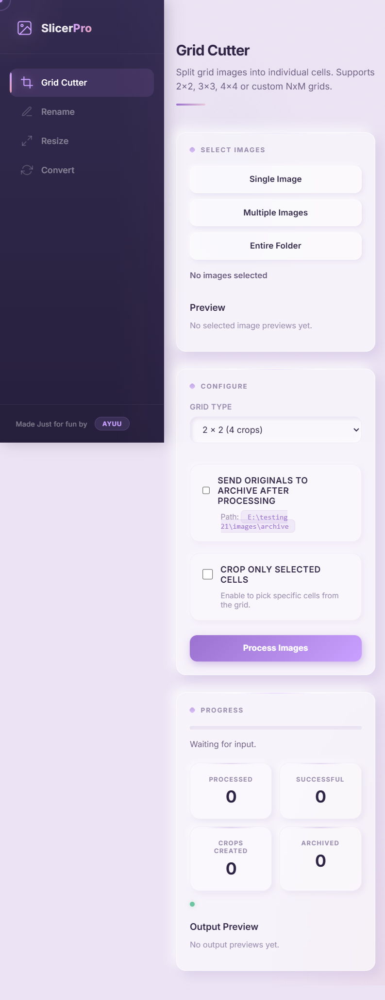
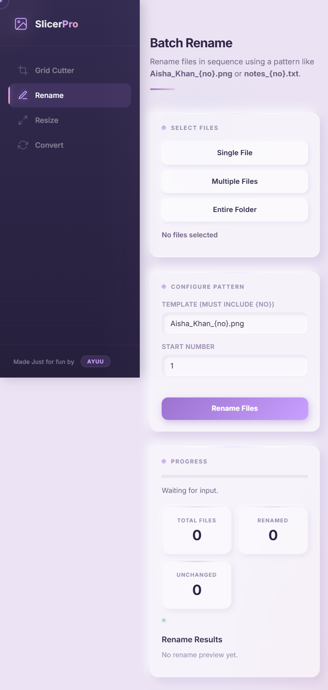
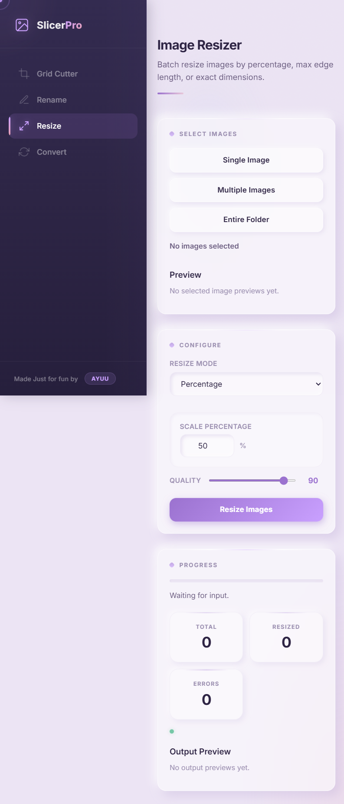
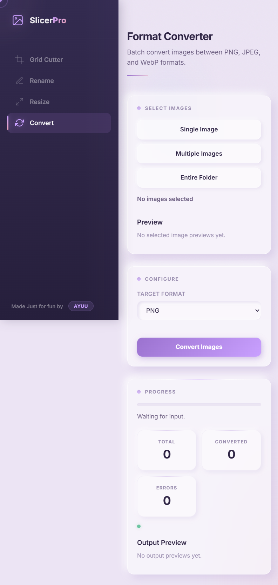
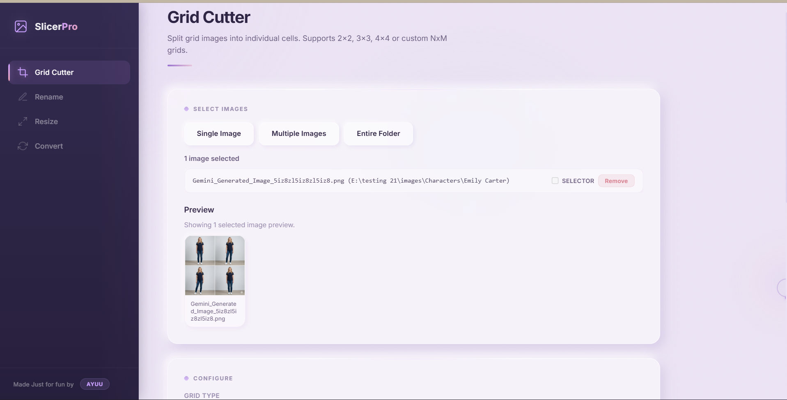
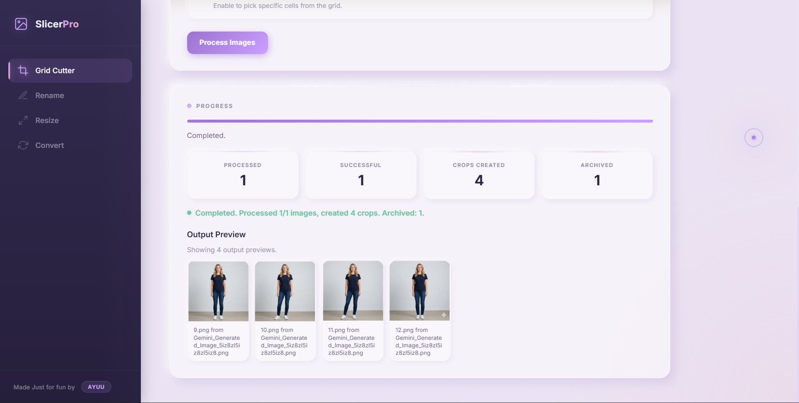

<div align="center">

# ✦ Slicer Pro

**A premium local image toolkit — crop, rename, resize & convert — all from your browser.**

Built with **Flask** + **Pillow** · Runs locally at `http://127.0.0.1:5000`

<br>


<br>

</div>

---

## ◆ Overview

Slicer Pro is a local-first image processing suite with four tools under one roof. No cloud uploads, no accounts, no subscriptions — just a clean interface running on your machine.

<br>

## ◆ Tools

<table>
<tr>
<td width="50%">

### ✂️ Grid Cutter

Split grid-based images into individual cells.

- Presets: **2×2**, **3×3**, **4×4**, **5×5** or custom **N×M** (up to 12×12)
- **Cell selector** — click only the cells you want
- Per-image selector targeting
- Archive originals after processing
- Smart collision-free naming (`1.png`, `2.png`, …)
- Live thumbnail previews

</td>
<td width="50%">

### ✏️ Batch Rename

Rename files in sequence using a template.

- Supports `.png`, `.jpg`, `.jpeg`, `.webp`, `.txt`
- Template with `{no}` placeholder
- Configurable start number
- Safe **two-phase rename** with rollback on failure
- Preview showing old → new names

</td>
</tr>
<tr>
<td width="50%">

### 📐 Image Resizer

Batch resize with three modes.

- **Percentage** — scale 1–1000%
- **Max Edge** — set longest side, keep aspect ratio
- **Exact Dimensions** — width × height with optional lock
- Quality slider (1–100)
- Output as `{name}_resized.{ext}`

</td>
<td width="50%">

### 🔄 Format Converter

Batch convert between formats.

- **PNG** ↔ **JPEG** ↔ **WebP**
- Auto RGBA → RGB for JPEG
- Quality slider for lossy formats
- Smart output naming
- Collision-free file handling

</td>
</tr>
</table>

<br>

## ◆ Screenshots

<div align="center">

| Grid Cutter | Batch Rename |
|:-----------:|:------------:|
|  |  |

| Image Resizer | Format Converter |
|:-------------:|:----------------:|
|  |  |

| Demo |
|:-----------:|
|  |
|  |

</div>

<br>

## ◆ Design

The UI follows a **Pastel Luxury Neumorphic** design language — combining soft depth with premium polish:

| Layer | Detail |
|-------|--------|
| **Palette** | Warm lavender canvas · lilac-amethyst accents · rose, mint, peach, sky companions |
| **Neumorphism** | Dual directional shadows on every card, button, input and tile — raised & sunken states |
| **Glass** | Frosted `backdrop-filter: blur(16px)` cards with white-lavender borders |
| **Sidebar** | Deep plum gradient (`#332b50` → `#261f3c`) with glowing lilac active bar |
| **Interactions** | Mouse-tracking radial glow · gradient shimmer buttons · staggered card reveals |
| **Cursor** | Three-layer animated cursor — snappy dot, trailing ring, lazy ambient glow |
| **Micro-details** | Linen texture overlay · progress bar pulse + shimmer · completion pulse dot · spring easing · custom scrollbar |
| **Responsive** | Full mobile support with slide-out sidebar |

<br>

## ◆ Tech Stack

| Component | Technology |
|-----------|------------|
| Backend | **Python 3** · **Flask** |
| Image Processing | **Pillow** (PIL) |
| File Picker | **tkinter** native dialogs |
| Concurrency | **Threading** — background workers, frontend polls at 600ms |
| Templates | **Jinja2** inheritance (`base.html` → page templates) |
| Frontend | Vanilla JS · CSS custom properties · `backdrop-filter` · CSS animations |
| Font | [Inter](https://rsms.me/inter/) (400–800) via Google Fonts |

<br>

## ◆ Project Structure

```
Slicer Pro/
│
├── app.py                  # Flask server + all backend logic
├── requirements.txt        # Dependencies (Flask, Pillow)
├── .gitignore
├── README.md
│
├── templates/
│   ├── base.html           # Shared layout — sidebar, cursor, scripts
│   ├── index.html          # Grid Cutter
│   ├── rename.html         # Batch Rename
│   ├── resize.html         # Image Resizer
│   └── convert.html        # Format Converter
│
├── static/
│   ├── styles.css          # Complete design system (~1400 lines)
│   ├── app.js              # Grid Cutter frontend
│   ├── rename.js           # Batch Rename frontend
│   ├── resize.js           # Image Resizer frontend
│   └── convert.js          # Format Converter frontend
│
└── screenshots/            # UI screenshots for README
```

<br>

## ◆ Quick Start

### Prerequisites

- **Python 3.10+** installed
- **pip** available in your terminal

### Setup

```bash
# Clone the repository
git clone https://github.com/YOUR_USERNAME/slicer-pro.git
cd slicer-pro

# Create a virtual environment
python -m venv .venv

# Activate it
# Windows:
.venv\Scripts\activate
# macOS/Linux:
source .venv/bin/activate

# Install dependencies
pip install -r requirements.txt

# Run the app
python app.py
```

Then open **http://127.0.0.1:5000** in your browser.

<br>

## ◆ Supported Formats

| Tool | Formats |
|------|---------|
| Grid Cutter | `.png` `.jpg` `.jpeg` `.webp` |
| Batch Rename | `.png` `.jpg` `.jpeg` `.webp` `.txt` |
| Image Resizer | `.png` `.jpg` `.jpeg` `.webp` |
| Format Converter | `.png` `.jpg` `.jpeg` `.webp` |

<br>

## ◆ Architecture Notes

- Each tool has its own **`SelectionQueue`** (thread-safe ordered unique paths) and **`JobStore`** (thread-safe job dictionary)
- Background processing runs in **worker threads** — the frontend polls `/api/*/status` every 600ms
- **Jinja2 template inheritance** — `base.html` defines the sidebar, page blocks, and all shared JS
- All image operations are handled by **Pillow** — no external CLI tools needed
- File picker uses **tkinter.filedialog** — launches native OS dialogs from the Flask server

<br>

---

<div align="center">

**Made just for fun by Ayuu**

</div>
